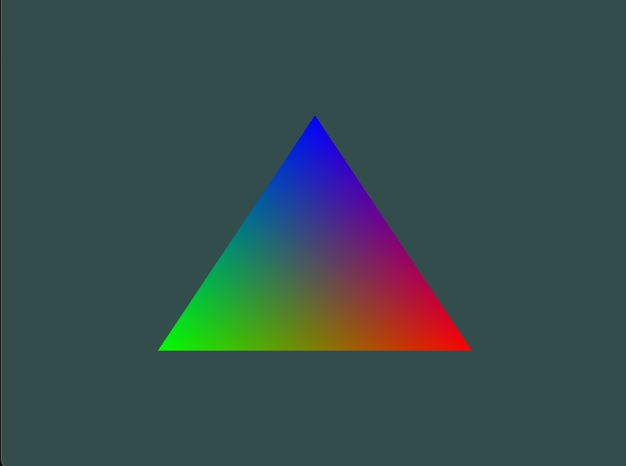

# OpenGL-triangle

Simple Hello World graphical program !

This is a simple OpenGL program that draws a triangle on the screen. It uses the GLFW library to create a window and an OpenGL context, and the GLEW library to access OpenGL functions.

how can i enbed a image in markdown file ?

## Leaned from

[LearnOpenGL](https://learnopengl.com/Getting-started/Hello-Triangle)
[OpenGl Book](https://learnopengl.com/book/book_pdf.pdf)
